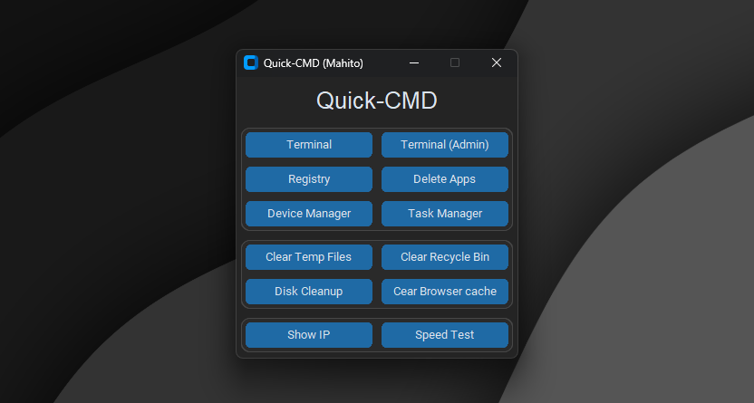

# Quick-CMD by Mahito

Quick-CMD is a Utility tool for windows to fastly do specific things on windows. For example deleting apps fasts without needing 
to click trough 10 different pages and 2 different setting applications or cleaning tempoary windows files, the recycle bin or the 
browser cache from Firefox, Chrome, Edge etc. with just one click. If anyone has requests or ideas that i can add, dm me and i 
wouldnt mind to review and add them to the Utility. Thanks for everyone trying out this Utility tool, thanks and have fun :)

---

## Table of contents

- [Screenshots](#screenshots)
- [Features](#features)
- [Installation](#installation)
- [Dependencies](#dependencies)
- [Requests/Ideas](#requests)

---

## Screenshots

  

## Features

- Quick open Terminal with and without admin
- Quick open the Registry Editor
- Quick open the old Control Panel delete application panel
- Quick open the device manager
- Quick open the task manager
- Clearing the tempoary files in C:/Windows/Temp