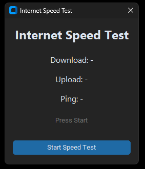
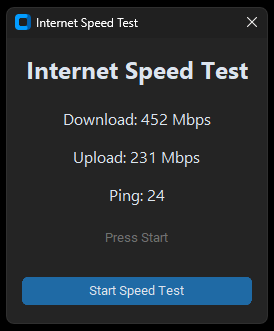

# Quick-CMD by Mahito
[](https://github.com/Mahito994/Quick-CMD/releases)

Quick-CMD is a Utility tool for windows to fastly do specific things on windows. For example deleting apps fasts without needing 
to click trough 10 different pages and 2 different setting applications or cleaning tempoary windows files, the recycle bin or the 
browser cache from Firefox, Chrome, Edge etc. with just one click. If anyone has requests or ideas that i can add, dm me and i 
wouldnt mind to review and add them to the Utility. Thanks for everyone trying out this Utility tool, thanks and have fun :)

---

## Table of contents

- [Screenshots](#screenshots)
- [Features](#features)
- [Installation](#installation)
- [Dependencies](#dependencies)
- [Requests, Ideas & Bug Reports](#requests-ideas--bug-reports)

---

## Screenshots
<div align="center">
  
</div>

<details>
<summary><b>Speedtest Window</b></summary>
<div align="center">

| Speedtest Window | Speedtest Results |
|:----------------:|:----------------:|
|  |  |

</div>
</details>

---

## Features

- Quick open Terminal with and without admin
- Quick open the Registry Editor
- Quick open the old Control Panel delete application panel
- Quick open the device manager
- Quick open the task manager
- Clearing the tempoary files in C:/Windows/Temp
- Clearing the Recycle Bin
- Quickly making a Disk Cleanup
- Clearing the Browser Cache (Firefox, Chrome, Edge, etc...)
- Showing the Local & Public IP-Address
- Making a Internet Speedtest (via speedtest-cli)

---

## Installation

You can install **Quick-CMD** in two different ways depending on whether you want the ready-to-use executable or run the project from source.

### Method 1 — Download the Executable (Recommended)

1. Go to the [Releases](https://github.com/Mahito994/Quick-CMD/releases/tag/v1.0) page of this repository
2. Download the latest `.exe` file
3. Run the executable

No Python installation is required.

---

### Method 2 — Run from Source

> [!IMPORTANT]
> Make sure that you installed [Python 3.x](https://www.python.org/downloads/) first. (you can check with `python --version`)

1. Clone the repository

```bash
git clone https://github.com/Mahito994/Quick-CMD.git
```

2. Navigate into the project folder

```bash
cd Quick-CMD
```

3. Install the required dependencies

```bash
pip install -r requirements.txt
```

4. Run the application

```bash
python quick-cmd.py
```

---

## Dependencies

Quick-CMD uses a small set of Python libraries to provide its graphical interface and system utilities.

| Library                         | Purpose                                                                 |
| ------------------------------- | ----------------------------------------------------------------------- |
| **customtkinter**               | Creates the modern graphical user interface (GUI) for the application.  |
| **speedtest-cli** (speedtest)   | Performs the internet speed test (download, upload, and ping).          |
| **requests**                    | Retrieves the public IP address using an external API.                  |
| **socket**                      | Gets the local IP address of the computer.                              |
| **winshell**                    | Allows interaction with Windows features like emptying the Recycle Bin. |
| **tkinter**                     | Used for popup dialogs such as error and information messages.          |
| **threading**                   | Runs the speed test in a background thread so the UI does not freeze.   |
| **tempfile**                    | Finds the system temporary folder for cleanup operations.               |
| **subprocess**                  | Launches Windows tools like CMD, Task Manager, or Disk Cleanup.         |
| **ctypes**                      | Allows running certain programs with administrator privileges.          |
| **os**                          | Handles file paths, environment variables, and system operations.       |
| **sys**                         | Used for handling runtime behavior and PyInstaller resource paths.      |
| **PyInstaller**                 | Used to package the application into a standalone `.exe` file for Windows.

---

## Requests, Ideas & Bug Reports
[](https://github.com/Mahito994/Quick-CMD/issues)

Found a bug, have a feature request, or an idea to improve **Quick-CMD**? I'd love to hear it!

### <u>Bug Reports</u>

If you find a bug or something isn't working correctly, please open a [**GitHub Issue**](https://github.com/Mahito994/Quick-CMD/issues) and describe the problem.

Try to include:

* What happened
* What you expected to happen
* Steps to reproduce the issue


### Feature Requests & Ideas

Have an idea for a new feature or improvement? Feel free to suggest it!

You can:

* Open a [**GitHub Issue**](https://github.com/Mahito994/Quick-CMD/issues)
* Or contact me directly

### Contact

You can reach me here:

* **TikTok:** [@mahito994](https://www.tiktok.com/@mahito994)
* **Discord:** @mahito_994

Thanks for helping improve **Quick-CMD**!
